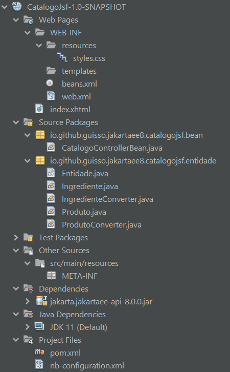

# CatalogoJsf
A demo about AJAX on a master-details Pizzas' catalog application.

## Suggested analysis order

1. [web.xml](/src/main/webapp/WEB-INF/web.xml)
2. [Entidade.java](/src/main/java/io/github/guisso/jakartaee8/catalogojsf/entidade/Entidade.java)
3. [Produto.java](/src/main/java/io/github/guisso/jakartaee8/catalogojsf/entidade/Produto.java)
4. [Ingrediente.java](/src/main/java/io/github/guisso/jakartaee8/catalogojsf/entidade/Ingrediente.java)
5. [ProdutoConverter.java](/src/main/java/io/github/guisso/jakartaee8/catalogojsf/entidade/ProdutoConverter.java)
6. [IngredienteConverter.java](/src/main/java/io/github/guisso/jakartaee8/catalogojsf/entidade/IngredienteConverter.java)
7. [CatalogoControllerBean.java](/src/main/java/io/github/guisso/jakartaee8/catalogojsf/bean/CatalogoControllerBean.java)
8. [index.xhtml](/src/main/webapp/index.xhtml)

## Reference

The Jakarta EE 8 Tutorial: Using Ajax with Jakarta Server Faces Technology

<https://eclipse-ee4j.github.io/jakartaee-tutorial/jsf-ajax.html>
